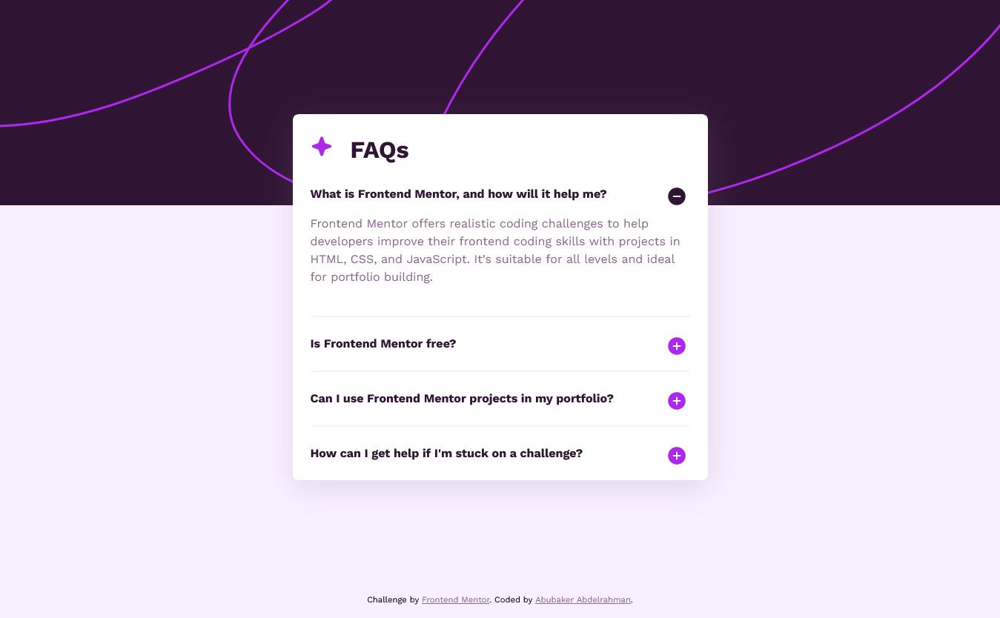
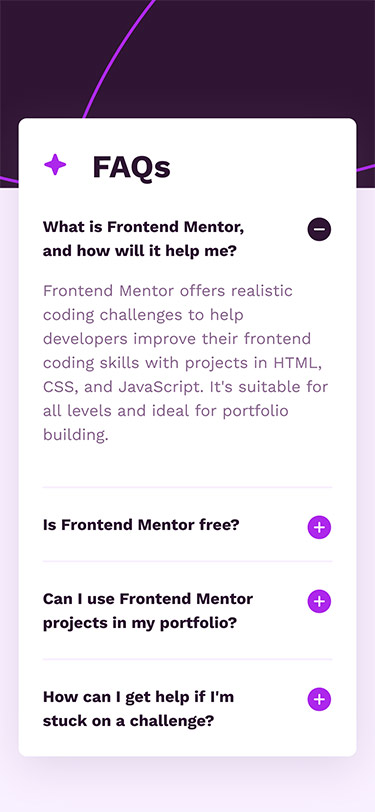

# Frontend Mentor - FAQ accordion solution

This is a solution to the [FAQ accordion challenge on Frontend Mentor](https://www.frontendmentor.io/challenges/faq-accordion-wyfFdeBwBz). Frontend Mentor challenges help you improve your coding skills by building realistic projects. 

## Table of contents

- [Overview](#overview)
  - [The challenge](#the-challenge)
  - [Screenshot](#screenshot)
  - [Links](#links)
- [My process](#my-process)
  - [Built with](#built-with)
  - [What I learned](#what-i-learned)
  - [Continued development](#continued-development)
  - [Useful resources](#useful-resources)
- [Author](#author)

## Overview

### The challenge

Users should be able to:

- Hide/Show the answer to a question when the question is clicked
- Navigate the questions and hide/show answers using keyboard navigation alone
- View the optimal layout for the interface depending on their device's screen size
- See hover and focus states for all interactive elements on the page

### Screenshot




### Links

- Solution URL: [GitHub](https://github.com/AbubakerCodes/faq-accordion-main)
- Live Site URL: [Add live site URL here](https://your-live-site-url.com)

## My process

### Built With

- **Semantic HTML5 Markup:** Utilizing semantic elements to enhance the structure and clarity of the HTML code.

- **CSS3:** Leveraging the power of CSS custom properties for maintainability, along with Flexbox for efficient and responsive layout design.

- **JavaScript (ES6):** Implementing ES6 features to enhance the interactivity and functionality of the project.

- **Mobile-First Workflow:** Adopting a mobile-first approach during development to ensure a seamless and optimized experience on various devices and screen sizes.

## What I Learned

Through this project, I gained valuable insights into:

- Effectively using semantic HTML5 markup.
- Leveraging CSS custom properties and Flexbox for responsive design.
- Applying a mobile-first workflow to optimize user experience.

These learnings contribute to my ongoing growth as a frontend developer.

### Continued Development

While working on this project, I faced challenges when styling the `summary::markers`. Specifically, adjusting their appearance and positioning proved to be tricky. With the valuable guidance from MDN's documentation on the [details element](https://developer.mozilla.org/en-US/docs/Web/HTML/Element/details) and insightful assistance from ChatGPT, I successfully overcame these obstacles.

Below is an example of the CSS code used to style the `::before` pseudo-element for the `summary`:

```css
summary::before {
    content: '';
    background: url('../images/icon-plus.svg') no-repeat center right;
    background-size: contain;
    width: 30px;
    height: 30px;
    position: absolute;
    right: 0;
    left: 113%;
}
```

Moving forward, I aim to explore more advanced techniques for enhancing user interface elements and refining my skills in CSS styling.

### Useful Resources

- [MDN](https://developer.mozilla.org/en-US/docs/Web/HTML/Element/details): Detailed documentation on the `details` element.

- [ChatGPT](https://chat.openai.com): Guidance for styling `::markers`, with a note of caution about occasional mistakes. 🤖

## Author

- LinkedIn - [AbubakerCodes](https://www.linkedin.com/in/AbubakerCodes)
- Frontend Mentor - [AbubakerCodes](https://www.frontendmentor.io/profile/AbubakerCodes)
